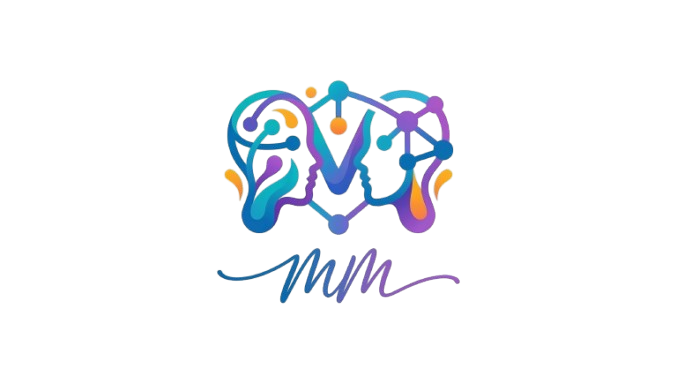

<p align="center">
  
</p>

<h1 align="center">MindMesh</h1>

<p align="center">
  <strong>AI-Powered Collaborative Study Platform</strong><br/>
  <em>Create live study rooms, discover peer mentors, and accelerate your learning — all in one student-first workspace.</em>
</p>

<p align="center">
  
  
  
  
  
  
</p>

---

## 📖 Table of Contents

- [Overview](#-overview)
- [Key Features](#-key-features)
- [Tech Stack](#-tech-stack)
- [Architecture](#-architecture)
- [Project Structure](#-project-structure)
- [Database Schema](#-database-schema)
- [API Reference](#-api-reference)
- [Real-Time Events (Socket.IO)](#-real-time-events-socketio)
- [AI Integration](#-ai-integration)
- [Getting Started](#-getting-started)
- [Environment Variables](#-environment-variables)
- [Deployment](#-deployment)
- [Team](#-team)
- [License](#-license)

---

## 🧠 Overview

**MindMesh** is a full-stack, real-time collaborative study platform built for students. It combines live video/audio study rooms, AI-powered tools, peer discovery with skill-based matching, and gamified engagement — all wrapped in a sleek, modern dark-mode interface.

The platform is designed to solve the problem of fragmented study workflows by bringing together group study, AI tutoring, document analysis, and social peer-matching into a single, cohesive application.

### 🎯 Problem Statement

Students often struggle with:
- Finding study partners who share complementary skills
- Coordinating real-time collaborative study sessions
- Accessing AI-powered academic tools within their study workflow
- Staying motivated and consistent with their learning habits

### 💡 Solution

MindMesh addresses these challenges through:
- **Skill-based peer discovery** with a Tinder-style swipe matching interface
- **Live study rooms** equipped with video conferencing, collaborative whiteboard, and AI tools
- **Mittar** — a context-aware AI assistant that navigates the platform, creates groups, and answers questions
- **Gamified streak system** with quests, XP, and grace periods to foster consistent learning habits

---

## ✨ Key Features

### 🏠 Live Study Rooms

| Feature | Description |
|---------|-------------|
| **WebRTC Video & Audio** | Peer-to-peer mesh video conferencing with camera and screen sharing |
| **Collaborative Whiteboard** | Real-time multi-user drawing canvas with color palette, pen/eraser tools, and sync across participants |
| **Pomodoro Timer** | Shared focus timer with Work / Short Break / Long Break modes, synced across the room |
| **PDF Analysis** | Upload PDFs/TXT files, auto-extract key points via AI, and Q&A with the document |
| **AI Tutor Module** | Generate AI-powered study modules with topic explanations, roadmaps, key concepts, and quiz questions |
| **Group Chat** | Real-time in-room messaging via Socket.IO |
| **Feature Locking** | Concurrent access control — only one user can operate AI/PDF tools at a time, preventing conflicts |
| **Session Scheduling** | Schedule future sessions with automatic activation and email/push notifications |

### 🔍 Discover & Connect

| Feature | Description |
|---------|-------------|
| **Tinder-Style Matching** | Swipe-based discovery UI with match-score highlighting for complementary skills |
| **Skill Profiles** | Set "Skills to Teach" and "Skills to Learn" for intelligent matchmaking |
| **Follow / Connect System** | Send connection requests, accept/reject, and manage your network |
| **Mutual Skill Highlighting** | Visual badges show when a user teaches what you want to learn (and vice versa) |

### 🤖 Mittar — AI Assistant

- **Context-aware**: Knows your current page, user profile, academic metrics, and platform state
- **Navigation Actions**: Can navigate you to any page on the platform via `[NAVIGATE:path]` tags
- **Group Creation**: Create study groups through natural language commands via `[CREATE_GROUP:{...}]` tags
- **Private Group Support**: Handles PIN-protected private rooms with 4–6 digit passcode validation
- **Persistent Chat**: Chat history saved in `localStorage` across sessions

### 📊 Student Dashboard

| Feature | Description |
|---------|-------------|
| **Profile Management** | Editable fields for branch, semester, year, roll number, and institution |
| **Intelligence Extraction** | Upload marks card images — AI (Gemini Vision) extracts subjects, scores, and GPA |
| **Smart Insights** | Auto-generated insights based on academic performance (spread analysis, at-risk detection, strength mapping) |
| **Grading System** | Custom grading scale: S / A / B / C / D / F / X / NE with color-coded badges |
| **Streak System** | Daily login streaks with grace periods, quests, XP, and streak restoration mechanics |
| **My Groups** | Quick access card showing your active study groups |

### 🔔 Notifications

- Real-time push notifications via Socket.IO for session activations, group invitations, and follow requests
- Notification bell with unread count badge
- Clickable notifications with deep links to relevant pages

---

## 🛠 Tech Stack

### Frontend

| Technology | Purpose |
|------------|---------|
| **Next.js 16.1** | React framework with App Router, SSR, and API routes |
| **React 19.2** | UI component library with hooks |
| **Tailwind CSS 4** | Utility-first CSS framework |
| **Framer Motion 12** | Animation library for transitions, gestures, and micro-interactions |
| **Lucide React** | Icon library |
| **React Type Animation** | Typewriter effect on the landing page hero |
| **Spline React** | 3D interactive elements (landing page) |
| **React Toastify** | Toast notification system |

### Backend

| Technology | Purpose |
|------------|---------|
| **Node.js** | Server runtime |
| **Custom HTTP Server** | Wraps Next.js with Socket.IO for WebSocket support |
| **Socket.IO 4.8** | Real-time bidirectional communication |
| **Mongoose 9.3** | MongoDB ODM for data modeling |
| **NextAuth.js 4** | Authentication (Google & GitHub OAuth) |
| **Nodemailer** | Email notifications for session activations |
| **pdf-parse / pdfreader** | Server-side PDF text extraction |

### AI / ML

| Service | Usage |
|---------|-------|
| **OpenRouter API** | Unified API gateway for AI model access |
| **Meta Llama 3.1 8B** | General chat, Mittar assistant, and AI tutoring |
| **Google Gemini Flash 1.5** | PDF document analysis and marks card vision extraction |

### Infrastructure

| Service | Purpose |
|---------|---------|
| **MongoDB Atlas** | Cloud-hosted database |
| **Vercel** | Frontend hosting (static + API routes proxy) |
| **Render / Railway** | Backend hosting (custom server with Socket.IO) |
| **Google STUN Servers** | WebRTC ICE candidate resolution |

---

## 🏗 Architecture

```
┌─────────────────────────────────────────────────────────────┐
│                         CLIENT (Browser)                     │
│                                                              │
│  ┌──────────┐  ┌──────────┐  ┌──────────┐  ┌──────────┐    │
│  │  Landing  │  │Dashboard │  │ Groups & │  │ Discover │    │
│  │   Page    │  │  (SDash) │  │ Sessions │  │ (Swipe)  │    │
│  └──────────┘  └──────────┘  └──────────┘  └──────────┘    │
│        │              │             │              │         │
│        └──────────────┴─────────────┴──────────────┘         │
│                           │                                  │
│                    Socket.IO Client                          │
│                    WebRTC (Mesh P2P)                          │
└─────────────────────────────┬───────────────────────────────┘
                              │
                    HTTPS / WSS (TLS)
                              │
┌─────────────────────────────┴───────────────────────────────┐
│                    CUSTOM NODE SERVER                         │
│                                                              │
│  ┌──────────────────────────────────────────────────────┐    │
│  │                    server.js                          │    │
│  │                                                       │    │
│  │  ┌───────────┐  ┌────────────┐  ┌────────────────┐   │    │
│  │  │  Next.js   │  │ Socket.IO  │  │  Session Cron  │   │    │
│  │  │  Handler   │  │  Server    │  │  (60s interval)│   │    │
│  │  └───────────┘  └────────────┘  └────────────────┘   │    │
│  │                       │                               │    │
│  │         ┌─────────────┼─────────────┐                 │    │
│  │         │             │             │                 │    │
│  │    Room Mgmt    Lock State    Session Data            │    │
│  │    (sessions,   (AI, PDF,    (AI modules,             │    │
│  │     groups)     whiteboard)   PDF content)             │    │
│  └──────────────────────────────────────────────────────┘    │
│                                                              │
│  ┌──────────────────────────────────────────────────────┐    │
│  │              Next.js API Routes (/api/*)               │    │
│  │                                                       │    │
│  │  /api/auth/*      → NextAuth (Google, GitHub)         │    │
│  │  /api/chat        → AI Chat (Llama / Gemini)          │    │
│  │  /api/groups/*    → CRUD for study groups             │    │
│  │  /api/sessions/*  → Session check / activation        │    │
│  │  /api/pdf         → PDF text extraction               │    │
│  │  /api/users/*     → Profile, discover, follow, etc.   │    │
│  │  /api/streak/*    → Streak check-in, quests, XP       │    │
│  │  /api/messages/*  → Direct messaging                  │    │
│  │  /api/notifications/* → Notification CRUD             │    │
│  └──────────────────────────────────────────────────────┘    │
└─────────────────────────────┬───────────────────────────────┘
                              │
                     Mongoose ODM
                              │
                 ┌────────────┴────────────┐
                 │     MongoDB Atlas        │
                 │                          │
                 │  Collections:            │
                 │  • users                 │
                 │  • groups                │
                 │  • messages              │
                 │  • notifications         │
                 │  • invitations           │
                 └─────────────────────────┘
```

### Request Flow

1. **Authentication**: Google/GitHub OAuth via NextAuth → JWT session tokens stored in cookies
2. **API Requests**: Next.js API routes handle business logic, connect to MongoDB via Mongoose
3. **Real-time**: Socket.IO handles room management, WebRTC signaling, feature sync, and push notifications
4. **AI Pipeline**: API route → OpenRouter → Llama 3.1 (chat) or Gemini Flash (documents)

---

## 📂 Project Structure

```
mindmesh/
├── app/
│   ├── api/                    # Next.js API routes
│   │   ├── auth/               # NextAuth endpoints
│   │   ├── chat/route.js       # AI chat (Mittar, general, PDF Q&A)
│   │   ├── groups/             # Group CRUD & member management
│   │   ├── messages/           # Direct messaging
│   │   ├── notifications/      # Notification CRUD
│   │   ├── pdf/route.js        # PDF text extraction (pdfreader)
│   │   ├── sessions/           # Session activation checker
│   │   ├── streak/             # Streak system (check-in, quests, XP)
│   │   └── users/              # Profile, discover, follow, connections
│   │
│   ├── Components/             # Shared UI components
│   │   ├── Header.js           # Navigation header (landing)
│   │   ├── Header2.js          # Navigation header (authenticated)
│   │   ├── Hero.js             # Landing page hero with animations
│   │   ├── Features.js         # Feature showcase section
│   │   ├── HIW.js              # "How It Works" section
│   │   ├── MittarChat.js       # Global AI assistant chat widget
│   │   ├── NotificationBell.js # Real-time notification bell
│   │   ├── SocketProvider.js   # Global Socket.IO context provider
│   │   └── ...                 # Footer, CTA, Testimonials, About*
│   │
│   ├── component/              # Page-specific sub-components
│   │   ├── StreakCard.js        # Gamified streak widget
│   │   ├── DiscoverySkills.js  # Skill management for matching
│   │   ├── ProfileCard.js      # Dashboard profile card
│   │   ├── MyGroups.js         # Groups quick-access card
│   │   └── ...                 # Progress, ResultUploader, etc.
│   │
│   ├── models/                 # Mongoose schemas
│   │   ├── User.js             # User model (profile, skills, streak, metrics)
│   │   ├── Group.js            # Group model (sessions, members, comments)
│   │   ├── Message.js          # Direct message model
│   │   ├── Notification.js     # Notification model
│   │   └── invitation.js       # Group invitation model
│   │
│   ├── controllers/            # Business logic controllers
│   │   └── groupController.js  # Group operation helpers
│   │
│   ├── lib/                    # Utility libraries
│   │   └── email.js            # Nodemailer email service
│   │
│   ├── Home/page.js            # Landing page
│   ├── About/page.js           # About page
│   ├── Login/page.js           # Authentication page
│   ├── SDash/page.js           # Student Dashboard
│   ├── discover/page.js        # Peer Discovery (swipe UI)
│   ├── profile/page.js         # Full profile page
│   ├── groups/
│   │   ├── page.js             # Groups listing + search
│   │   ├── create/page.js      # Create new group
│   │   └── [groupId]/
│   │       ├── page.js         # Group details + chat
│   │       └── session/
│   │           └── [sessionId]/
│   │               └── page.js # Live study room (1800+ lines)
│   │
│   ├── auth.js                 # NextAuth configuration
│   ├── providers.js            # SessionProvider wrapper
│   ├── layout.js               # Root layout
│   └── globals.css             # Global styles
│
├── db/
│   └── connectDB.js            # MongoDB connection (cached singleton)
│
├── public/                     # Static assets
│   ├── logo.png                # MindMesh logo
│   ├── favicon.ico             # Favicon
│   └── ...                     # Team photos, icons
│
├── server.js                   # Custom HTTP + Socket.IO server
├── package.json
├── next.config.mjs             # Next.js config (image remotePatterns)
├── vercel.json                 # Vercel rewrites for API proxy
├── tsconfig.json
└── postcss.config.mjs
```

---

## 💾 Database Schema

### User Model

```javascript
{
  email:            String (unique, required),
  name:             String,
  profilePicture:   String,
  bio:              String (max 250),
  branch:           String,          // e.g., "Computer Science"
  semester:         String,          // e.g., "4th"
  year:             String,          // e.g., "2nd Year"
  rollNumber:       String,
  institution:      String,
  
  // Learning
  domains:          [String],        // 3-6 selections
  subjects:         [String],        // e.g., ["React", "Python"]
  skillLevel:       String,          // Beginner | Intermediate | Advanced
  goal:             String,          // e.g., "Build a Portfolio"
  
  // Matchmaking
  skillsToTeach:    [String],        // Skills the user can teach
  skillsToLearn:    [String],        // Skills the user wants to learn
  
  // Social
  followers:        [ObjectId → User],
  following:        [ObjectId → User],
  followRequests:   [{ from, message, createdAt }],
  
  // Streak System
  streak: {
    current:          Number,
    best:             Number,
    lastLoginDate:    String,        // YYYY-MM-DD
    sessionsAttended: Number,
    graceActive:      Boolean,
    graceExpiresAt:   Date,
    quests:           [{ id, title, description, type, completed, xp }],
    totalXp:          Number
  },
  
  // Academic Metrics (AI-analyzed)
  academicMetrics: {
    semester:   String,
    gpa:        String,
    attendance: String,
    subjects:   [{ name, percent, color }],
    upcoming:   [{ subject, task, date }],
    activity:   [{ text, bold, time, color }]
  }
}
```

### Group Model

```javascript
{
  name:        String (required, max 100),
  subject:     String (required),
  description: String (max 500),
  owner:       ObjectId → User,
  members:     [ObjectId → User],
  maxMembers:  Number (2-100, default 20),
  isPrivate:   Boolean,
  passcode:    String (4-6 digit PIN for private groups),
  tags:        [String],
  sessions:    [{
    date:      Date,
    startTime: String,    // "HH:MM"
    endTime:   String,    // "HH:MM"
    note:      String,
    status:    String,    // scheduled | active | completed
    participants: [ObjectId → User]
  }],
  comments:    [{ author: ObjectId, content: String }]
}
```

### Message Model

```javascript
{
  from:    ObjectId → User,
  to:      ObjectId → User,
  content: String (max 2000),
  read:    Boolean
}
```

### Notification Model

```javascript
{
  recipient: ObjectId → User,
  sender:    ObjectId → User,
  type:      String,   // GROUP_ADDED | FOLLOW_REQUEST | FOLLOW_ACCEPTED | MESSAGE
  title:     String,
  message:   String,
  link:      String,   // Deep link path
  read:      Boolean
}
```

---

## 🔌 API Reference

### Authentication

| Method | Endpoint | Description |
|--------|----------|-------------|
| `*` | `/api/auth/*` | NextAuth.js handlers (Google & GitHub OAuth) |

### Chat & AI

| Method | Endpoint | Description |
|--------|----------|-------------|
| `POST` | `/api/chat` | Unified AI endpoint — routes to Mittar, general chat, or PDF Q&A based on request body flags |

**Request Body:**
```json
{
  "message": "...",
  "history": [],
  "isMittar": true,
  "pathname": "/SDash",
  "pdfContext": "...",
  "pdfBase64": "...",
  "mimeType": "application/pdf"
}
```

### Groups

| Method | Endpoint | Description |
|--------|----------|-------------|
| `GET` | `/api/groups` | List all groups (with search/filter) |
| `POST` | `/api/groups` | Create a new group |
| `GET` | `/api/groups/[groupId]` | Get group details |
| `PATCH` | `/api/groups/[groupId]` | Update group |
| `DELETE` | `/api/groups/[groupId]` | Delete group |

### Users & Discovery

| Method | Endpoint | Description |
|--------|----------|-------------|
| `GET` | `/api/users/discover` | Get matchmaking suggestions |
| `GET` | `/api/users/profile` | Get current user profile |
| `PATCH` | `/api/users/profile` | Update profile fields |
| `GET` | `/api/users/connections` | Get connections & pending requests |
| `POST` | `/api/users/follow` | Send follow/connect request |
| `POST` | `/api/users/follow/respond` | Accept/reject a follow request |
| `POST` | `/api/users/analyze-result` | AI analysis of marks card image |

### Sessions

| Method | Endpoint | Description |
|--------|----------|-------------|
| `GET` | `/api/sessions/check` | Cron-triggered session activation check |

### Streak

| Method | Endpoint | Description |
|--------|----------|-------------|
| `POST` | `/api/streak/checkin` | Daily streak check-in |
| `POST` | `/api/streak/complete-quest` | Complete a streak quest |
| `POST` | `/api/streak/simulate` | Dev tools: simulate streak scenarios |
| `POST` | `/api/streak/xp` | Award XP to user |

### PDF

| Method | Endpoint | Description |
|--------|----------|-------------|
| `POST` | `/api/pdf` | Extract text from uploaded PDF file |

### Notifications & Messages

| Method | Endpoint | Description |
|--------|----------|-------------|
| `GET/PATCH` | `/api/notifications` | Get / mark-as-read notifications |
| `GET/POST` | `/api/messages` | Retrieve / send direct messages |

---

## 📡 Real-Time Events (Socket.IO)

The custom server (`server.js`) manages all WebSocket communication through Socket.IO. The server listens on the path `/api/socketio`.

### Room Types

| Room Pattern | Purpose |
|--------------|---------|
| `user:{userId}` | Personal room for DMs, notifications |
| `group:{groupId}` | Group chat & events |
| `session:{sessionId}` | Study room — video, whiteboard, sync |

### Event Reference

#### Session Management
| Event | Direction | Payload | Description |
|-------|-----------|---------|-------------|
| `join-session` | Client → Server | `{ sessionId, userId, userName }` | Join a study room |
| `session-users` | Server → Client | `[{ socketId, userId, userName }]` | Updated user list |

#### WebRTC Signaling
| Event | Direction | Payload | Description |
|-------|-----------|---------|-------------|
| `webrtc-offer` | Client ↔ Server | `{ sessionId, to, offer, fromUserId, fromUserName }` | SDP offer for P2P connection |
| `webrtc-answer` | Client ↔ Server | `{ to, answer }` | SDP answer |
| `webrtc-ice-candidate` | Client ↔ Server | `{ to, candidate }` | ICE candidate exchange |
| `media-status` | Client ↔ Server | `{ sessionId, userId, userName, type, status }` | Camera / screen share status |

#### Collaborative Tools
| Event | Direction | Payload | Description |
|-------|-----------|---------|-------------|
| `draw-data` | Client ↔ Server | `{ sessionId, drawingData }` | Whiteboard drawing data |
| `canvas-clear` | Client ↔ Server | `sessionId` | Clear the whiteboard |
| `pomodoro-sync` | Client ↔ Server | `{ sessionId, state }` | Pomodoro timer state |
| `pomodoro-start` | Client → All | `{ sessionId, state }` | Start timer (broadcasts to all) |
| `ai-tutor-sync` | Client ↔ Server | `{ sessionId, module }` | AI tutor module data |
| `pdf-sync` | Client ↔ Server | `{ sessionId, fileName, docText }` | PDF document sync |
| `pdf-content-sync` | Client ↔ Server | `{ sessionId, keyPoints, messages }` | PDF analysis results sync |

#### Feature Locking
| Event | Direction | Payload | Description |
|-------|-----------|---------|-------------|
| `feature-lock` | Client → Server | `{ sessionId, feature, userId, userName }` | Request lock on AI/PDF/whiteboard |
| `feature-unlock` | Client → Server | `{ sessionId, feature, userId }` | Release lock |
| `feature-lock-state` | Server → Client | `{ ai, pdf, whiteboard }` | Current lock state |
| `feature-lock-denied` | Server → Client | `{ feature, lockedBy }` | Lock request denied |

#### Messaging & Notifications
| Event | Direction | Payload | Description |
|-------|-----------|---------|-------------|
| `group-chat` | Client ↔ Server | `{ groupId, message }` | Group chat message |
| `dm-message` | Client ↔ Server | `{ to, message }` | Direct message |
| `session-activated` | Server → Client | `{ title, message, link, groupName }` | Session activation notification |

---

## 🤖 AI Integration

MindMesh uses **OpenRouter** as the unified API gateway to access multiple AI models:

### Model Routing Strategy

```
Request Type              → Model                    → Purpose
───────────────────────────────────────────────────────────────
Mittar (isMittar=true)    → Llama 3.1 8B Instruct   → Navigation, group creation, Q&A
General Chat              → Llama 3.1 8B Instruct   → Study help, explanations
PDF / Document Analysis   → Gemini Flash 1.5        → Text analysis, key extraction
Marks Card Vision         → Gemini Flash 1.5        → Image → structured data
```

### Mittar Action Tags

The AI assistant uses special tags in its responses that the frontend parses:

| Tag | Format | Action |
|-----|--------|--------|
| Navigation | `[NAVIGATE:/path]` | Programmatically route the user to the specified page |
| Group Creation | `[CREATE_GROUP:{"name":"...","subject":"..."}]` | Create a study group and redirect to it |

### PDF Analysis Pipeline

```
1. User uploads PDF/TXT file
2. Server extracts text via pdfreader (structured text extraction)
3. Text sent to Gemini Flash for key point extraction
4. Returns JSON: { topic, points[], predictions[] }
5. User can Q&A with the full document context
6. All analysis is synced to other session participants via Socket.IO
```

---

## 🚀 Getting Started

### Prerequisites

- **Node.js** 18+ (recommended: 20 LTS)
- **MongoDB** instance (local or [MongoDB Atlas](https://www.mongodb.com/atlas))
- **Google Cloud Console** project (for OAuth credentials)
- **GitHub OAuth App** (for GitHub login)
- **OpenRouter API Key** (for AI features)

### Installation

```bash
# 1. Clone the repository
git clone https://github.com/imjoe77/Mind-Mesh.git
cd Mind-Mesh

# 2. Install dependencies
npm install

# 3. Create environment file
cp .env.example .env.local
# Fill in all required environment variables (see below)

# 4. Start the development server
npm run dev
```

> **Note:** The `npm run dev` command runs `node server.js`, which starts the custom HTTP server with Next.js and Socket.IO attached. This is required for WebSocket support.

### Access the App

Open [http://localhost:3000](http://localhost:3000) in your browser.

---

## 🔐 Environment Variables

Create a `.env.local` file in the project root with the following variables:

```env
# ── Database ──
MONGODB_URI=mongodb+srv://<user>:<password>@cluster.mongodb.net/<dbname>

# ── NextAuth ──
NEXTAUTH_SECRET=<random-secret-string>
NEXTAUTH_URL=http://localhost:3000

# ── Google OAuth ──
GOOGLE_CLIENT_ID=<your-google-client-id>
GOOGLE_CLIENT_SECRET=<your-google-client-secret>

# ── GitHub OAuth ──
GITHUB_ID=<your-github-client-id>
GITHUB_SECRET=<your-github-client-secret>

# ── AI (OpenRouter) ──
OPENROUTER_API_KEY=<your-openrouter-api-key>

# ── Email (Nodemailer) ──
EMAIL_SERVER_HOST=smtp.gmail.com
EMAIL_SERVER_PORT=587
EMAIL_SERVER_USER=<your-email>
EMAIL_SERVER_PASSWORD=<your-app-password>
EMAIL_FROM=MindMesh <noreply@mindmesh.app>

# ── Public URL ──
NEXT_PUBLIC_URL=http://localhost:3000
NEXT_PUBLIC_BACKEND_URL=http://localhost:3000
```

| Variable | Required | Description |
|----------|----------|-------------|
| `MONGODB_URI` | ✅ | MongoDB connection string |
| `NEXTAUTH_SECRET` | ✅ | Secret for JWT signing |
| `NEXTAUTH_URL` | ✅ | Canonical URL for NextAuth |
| `GOOGLE_CLIENT_ID` | ✅ | Google OAuth 2.0 client ID |
| `GOOGLE_CLIENT_SECRET` | ✅ | Google OAuth 2.0 client secret |
| `GITHUB_ID` | ✅ | GitHub OAuth app client ID |
| `GITHUB_SECRET` | ✅ | GitHub OAuth app client secret |
| `OPENROUTER_API_KEY` | ✅ | OpenRouter API key for AI features |
| `EMAIL_SERVER_*` | ⚠️ | Required for email notifications (graceful fallback if not set) |
| `NEXT_PUBLIC_URL` | ✅ | Public-facing URL of the application |
| `NEXT_PUBLIC_BACKEND_URL` | ✅ | Backend URL (same as public URL in single-server setup) |

---

## 🌐 Deployment

### Architecture: Split Deployment

MindMesh uses a **split deployment** strategy:

| Component | Platform | Reason |
|-----------|----------|--------|
| **Frontend** | Vercel | Optimal Next.js hosting with edge network |
| **Backend** | Render / Railway | Custom server required for Socket.IO (WebSocket support) |

### Deploy to Vercel (Frontend)

```bash
# Install Vercel CLI
npm i -g vercel

# Deploy
vercel --prod
```

The `vercel.json` automatically proxies API and Socket.IO requests to the backend:

```json
{
  "rewrites": [
    { "source": "/api/socketio/:path*", "destination": "https://your-backend.onrender.com/api/socketio/:path*" },
    { "source": "/api/:path*", "destination": "https://your-backend.onrender.com/api/:path*" }
  ]
}
```

### Deploy to Render (Backend)

1. Create a new **Web Service** on [Render](https://render.com)
2. Connect your GitHub repository
3. Set the following:
   - **Build Command:** `npm install && npm run build`
   - **Start Command:** `npm start`
   - **Health Check Path:** `/health`
4. Add all environment variables from `.env.local`
5. Set `NODE_ENV=production`

### Production Configuration

```bash
# Production start command
NODE_ENV=production node server.js
```

The server binds to `0.0.0.0` and reads the port from `process.env.PORT` (defaults to 3000).

---

## 👥 Team

MindMesh was built during a hackathon by a team of passionate developers:

<table>
  <tr>
    <td align="center"><strong>Joel</strong><br/>Full-Stack Developer</td>
    <td align="center"><strong>Abhijith</strong><br/>Developer</td>
    <td align="center"><strong>Ansar</strong><br/>Developer</td>
    <td align="center"><strong>Nikhil</strong><br/>Developer</td>
  </tr>
</table>

---

## 📄 License

This project is licensed under the **MIT License**.

---

<p align="center">
  <sub>Built with ❤️ and ☕ during a hackathon · <strong>MindMesh</strong> © 2026</sub>
</p>
