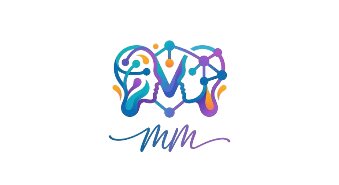

#   MindMesh

> 🚀 **Built during our first hackathon**

An AI-powered collaborative learning platform that brings students together through intelligent study groups, real-time collaboration, gamification, and AI-assisted learning.

<p align="center">


</p>

---

# 🌟 Overview

MindMesh is an AI-powered collaborative learning platform designed to make studying more interactive, engaging, and productive.

Built during our first hackathon, the platform combines real-time communication, AI-powered assistance, collaborative study spaces, and gamification to create an engaging environment where students can learn together and stay motivated.

From intelligent chat assistance to live study groups and achievement tracking, MindMesh focuses on making learning social rather than isolated.

---

# ✨ Features

## 🤖 AI Learning

- AI Study Assistant
- Intelligent Chat
- PDF Analysis
- Learning Recommendations

---

## 👥 Collaboration

- Study Groups
- Real-time Chat
- Student Discovery
- Friend System
- Follow Users

---

## 📚 Learning

- Shared Notes
- Resource Sharing
- Collaborative Sessions
- Academic Discussions

---

## 🏆 Gamification

- XP System
- Daily Streaks
- Achievements
- Student Progress

---

## 🔐 Authentication

- NextAuth Authentication
- OTP Verification
- Secure Login
- Protected Routes

---

# 🏗 Architecture

```text
                    MindMesh

                Next.js Frontend
                       │
      ┌────────────────┼───────────────┐
      │                │               │
  NextAuth        Socket.IO        AI Services
      │                │               │
      └────────────MongoDB─────────────┘
```

---

# 💻 Tech Stack

## Frontend

- Next.js
- React
- TypeScript
- Tailwind CSS

## Backend

- Node.js
- Express
- Socket.IO

## Authentication

- NextAuth

## Database

- MongoDB

## AI

- OpenAI / AI Chat Integration

## Deployment

- Vercel

---

# 📂 Project Structure

```text
MindMesh
│
├── app/
├── components/
├── lib/
├── models/
├── public/
├── hooks/
├── types/
├── utils/
├── README.md
└── .env.example
```

---

# ⚡ Getting Started

Clone the repository

```bash
git clone https://github.com/imjoe77/Mind-Mesh.git
```

Install dependencies

```bash
npm install
```

Run locally

```bash
npm run dev
```

---

# 🔐 Environment Variables

```env
MONGODB_URI=

NEXTAUTH_SECRET=

NEXTAUTH_URL=

GOOGLE_CLIENT_ID=

GOOGLE_CLIENT_SECRET=

OPENAI_API_KEY=

NEXT_PUBLIC_SOCKET_URL=
```

---

Add screenshots of

- Landing Page
- Dashboard
- Study Groups
- AI Chat
- PDF Analysis
- Profile
- Mobile View

---

# 🚀 Future Improvements

- Video Study Rooms
- Voice Chat
- AI Flashcards
- AI Quiz Generation
- Mobile Application
- Calendar Integration
- Live Whiteboard
- Leaderboards

---

# 🤝 Contributing

Contributions are welcome.

1. Fork the repository
2. Create a feature branch
3. Commit your changes
4. Open a Pull Request

---

# 📄 License

This project is licensed under the **MIT License**.

See the [LICENSE](LICENSE) file for details.

MIT License:
https://opensource.org/licenses/MIT

---

# 👨‍💻 Author

**Nathaniel Bandi**

GitHub:
https://github.com/imjoe77

---

⭐ If you like this project, consider giving it a star!
